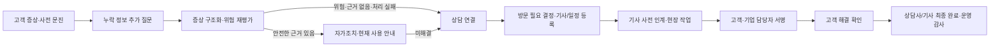

# 워터케어 ONE 정수기 고객케어·A/S 프로토타입

> 최종 갱신: 2026-07-21<br>
> 구현 기준: Schema v11 · Workflow 1.0 · Pre-Visit Questionnaire v2<br>
> 재현용 시연 데이터 기준일: 2026-07-16<br>
> 현재 상태: 고객·상담사·방문기사·운영 담당자의 업무가 연결되는 정적 HTML 프로토타입<br>
> 자동검증: `state-flow`, `requirements-v11`, `static-http-smoke` 모두 PASS

고객이 입력한 정수기 증상을 상담, 방문 점검, 작업 결과·서명, 고객 해결 확인과 운영 감사 이력까지 동일한 문의 ID로 연결하여 검증할 수 있도록 만든 Vanilla HTML/CSS/JavaScript 프로토타입입니다.

개인 고객뿐 아니라 기업·사무실 고객, 사업장과 복수 설치 제품을 포함하며, 화면만 구성한 시연물이 아니라 역할별 업무 전환과 상태 변경을 실제로 체험할 수 있도록 브라우저 로컬 상태를 공유합니다.

## 1. 프로젝트가 해결하려는 문제

기존 정수기 고객케어 과정에서는 고객이 설명한 증상과 제품 정보가 상담사와 방문기사에게 충분히 전달되지 않거나, 상담·방문·사후 확인이 서로 분리되어 같은 질문과 기록이 반복될 수 있습니다.

이 프로토타입은 다음 연결 구조를 검증합니다.

- 고객이 한 번 입력한 제품·증상·추가 답변을 다음 담당자가 재사용
- 안전 위험 신호와 공식 근거를 일반 안내보다 우선 처리
- 상담 결과와 방문 필요 여부를 구조화해 방문기사에게 전달
- 방문 일정 변경, 현장 작업, 확인 서명과 고객 해결 여부를 같은 문의에 누적
- 고객·상담사·방문기사·운영 담당자의 역할별 알림과 업무 화면 연결
- 처리 이력과 예외 상태를 운영 화면에서 추적



## 2. 사용자 역할과 화면

| 역할 | 주요 목표 | 주요 화면·기능 |
|---|---|---|
| 고객 | 내 제품과 케어 상태를 확인하고 증상 문의부터 해결 확인까지 진행 | 제품 관리, 사전 문진, 증상 문의, 추가 질문, 자가조치, 방문 일정 변경, 작업 확인서, 사용량, 스마트 준비, 매뉴얼 |
| 상담사 | 고객이 이미 제공한 정보와 근거를 보고 상담 해결 또는 방문 전환 결정 | 우선 상담 큐, 구조화 상담 기록, 방문 필요 판단, 기사·방문 일정 등록, 일정 변경 승인·반려 |
| 방문기사 | 배정된 방문 건의 사전 인계 내용을 확인하고 현장 결과를 기록 | 배정 방문 목록, 사전 점검 리포트, A/S·설치·수리·정기 케어 결과, 교체 항목, 고객 서명 |
| 운영 담당자 | 전체 흐름, 예외, VOC·지식과 변경 이력을 관리 | 통합 현황, 운영 분석, 일정 변경 검토, 지식·매뉴얼 메타데이터, 감사 로그 |

페이지 구성은 다음과 같습니다.

- `index.html`: 고객·관계자 포털을 선택하는 서비스 진입 화면
- `customer.html`: 개인·기업 고객용 반응형 포털
- `stakeholder.html`: 상담사·방문기사·운영 담당자 통합 업무 포털

관계자 포털은 상단 역할 선택에 따라 허용 메뉴와 접근 가능한 문의 범위를 바꿉니다.

## 3. 현재 시연 데이터

모든 고객·기업·일정·시리얼·서명·처리 기록은 가상 데이터입니다.

화면의 `오늘 2026.07.16`과 사용량 날짜는 실행 시점의 실제 오늘 날짜가 아니라, 팀원이 언제 실행해도 같은 상태와 결과를 재현하도록 고정한 **시연 기준일**입니다. 코드의 최종 기능 갱신일 2026-07-21과 구분합니다.

| 데이터 | 구성 |
|---|---|
| 고객 | 개인 고객 3명, 기업 고객 2곳 |
| 기업 구조 | 기업 2곳, 사업장 2곳, 대표 담당자 2명 |
| 설치 제품 | 총 6대, 기업 고객의 복수 설치 자산 포함 |
| 대상 모델 | `WPUJAC115DNW`, `WPUIAC425SNW` 2종 |
| 관계자 | 상담사 1명, 방문기사 2명, 운영 담당자 1명 |
| 문의 | 서로 다른 상태와 위험도를 가진 문의 5건 |
| 부가 데이터 | 사전 문진, 상담 세션, 방문·작업지시, 사용량, 스마트 준비, 알림, 지식 문서, 운영·감사 로그 |

현재 저장 데이터 계약은 `assets/js/mock-data.js`의 Schema v11이며, 기존 브라우저 상태는 `assets/js/store.js`에서 v8 → v9 → v10 → v11 순서로 보완 마이그레이션합니다.

대표 시연 계정은 다음과 같습니다.

| 계정 | 초기 상태 | 빠르게 확인할 수 있는 기능 |
|---|---|---|
| 김하늘 `CUS-001` | 상담 대기 | 자가조치 결과, 상담 인계, 역할별 알림 |
| 그린웨이브 스튜디오 `CUS-002` | 기업·방문 예정 | 복수 설치 제품, 위험 문의, 방문 일정 변경 |
| 이서준 `CUS-003` | 방문 완료 | 작업 결과, 고객 서명, 후속 해결 확인 |
| 최유나 `CUS-004` | 처리 완료 | 상담·방문·완료 전체 이력 |
| 한빛 세무회계 `CUS-005` | 추가 질문 필요 | 최초 원문 분석과 누락 정보만 추가 질문 |

## 4. 2026-07-21 주요 변경사항

7월 16일 초기 프로토타입 이후 최신 요구사항 교차검증에서 확인된 누락 사항을 다음과 같이 보완했습니다.

- 최초 증상 원문에서 확인 가능한 정보를 구조화하고 **누락된 필드만** 추가 질문하도록 변경
- 추가 답변의 누수·전기·온도·소음·지속·반복 신호에 따라 위험도와 우선순위를 재평가
- 위험 신호가 있으면 일반 자가조치를 제한하고 안전 문구와 상담 연결을 우선 제공
- 증상, 최근 케어·교체 이력과 연결 문서를 바탕으로 관리 이력·점검 후보 생성
- 상담사의 추가 확인사항, 고객 안내, 상담 결과, 방문 필요 여부를 상담 세션 단위로 분리 저장
- 방문기사에게 고객·제품·구독·문의·상담·방문·작업지시 식별자와 현장 재확인 항목 전달
- AI·근거 검색·스키마 처리 실패 시 기존 입력을 보존하고 재시도 또는 상담 연결 제공
- 고객 문의 소유권, 관계자 역할, 배정 기사 접근 권한 검사 추가
- 고객·제품 범위의 요청 ID와 본문 지문으로 중복 제출과 ID 충돌 방지
- 방문 완료 후 다음 케어일과 제품별 새 사전 문진 주기를 생성하고 KST·월말 날짜 보정
- 역할별 알림 센터, 개별·전체 읽음 처리와 문의·일정·감사 화면 딥링크 구현
- 역할·화면·문의 ID를 URL에 보존하고 역할 전환 시 접근할 수 없는 문의 ID 제거
- 처리 지연, 공식 근거 미발견과 처리 실패를 운영 예외로 자동 탐지
- Schema v11 회귀 테스트와 실제 브라우저 검증 추가

## 5. 기능 구현 범위

### 5.1 고객·기업·제품 관리

| 기능 | 구현 내용 | 현재 수준 |
|---|---|---|
| 개인·기업 고객 | 개인 계정과 기업 계정을 분리하고 기업·사업장·담당자·서비스 가능 시간을 표시 | 브라우저 시연 구현 |
| 복수 설치 자산 | 기업 사업장의 여러 정수기를 자산 태그와 설치 공간 기준으로 선택 | 브라우저 시연 구현 |
| 제품 등록·수정 | 모델, 사용 시작일, 관리 유형, 최근 케어일과 설치 사업장을 저장 | 로컬 상태 저장 |
| 실제 선정 모델 | SK매직 `WPUJAC115DNW`, `WPUIAC425SNW` 제품 이미지와 공식 제품정보 연결 | 실제 모델 정보·로컬 이미지 |
| 영상 매뉴얼 | 모델별 기능 설정과 필터·청소 영상을 정적 매핑 | 향후 YouTube Data API 교체 대상 |
| 360° 제품 보기 | 모델 자체를 마우스·터치로 드래그하거나 좌우 방향키로 회전 | 단순화한 HTML/CSS 시뮬레이션 |

### 5.2 케어·문진·고객 문의

| 기능 | 구현 내용 | 현재 수준 |
|---|---|---|
| 다음 케어 일정 | 제품 관리 주기와 최근 방문 완료일을 기준으로 다음 케어일 표시 | 합성 기준 데이터 |
| 제품별 사전 문진 | 출수, 누수, 물맛, 온도, 기수행 조치를 제품 단위로 제출 | Pre-Visit Questionnaire v2 |
| 문진 새 주기 | 방문 완료 후 기존 주기를 보존하고 다음 제품별 문진을 새로 생성 | 상태전환 구현 |
| 자연어 증상 문의 | 제품과 대표 증상을 선택하고 일상 표현으로 문의 등록 | 규칙 기반 시연 |
| 누락 정보 질문 | 이미 확인된 값은 다시 묻지 않고 발생 시점·출수·오류·동반 증상 등 누락 필드만 질문 | Schema v11 구현 |
| 위험도 재평가 | 최초 입력과 추가 답변을 합쳐 일반·주의·위험 및 처리 우선순위 재판정 | 사전 정의 규칙 기반 |
| 안전한 안내 | 위험 규칙, 점검 후보와 가상 문서 근거를 표시하고 위험한 직접 수리를 제한 | 가상 근거 기반 |
| 실패 복구 | 처리 실패 사유, 입력 보존, 재시도와 상담 전환 제공 | 브라우저 시연 구현 |

### 5.3 상담·방문·사후 확인

| 기능 | 구현 내용 | 현재 수준 |
|---|---|---|
| 구조화 상담 기록 | 상담 세션 ID, 추가 확인, 고객 안내, 상담 결과와 방문 필요 여부를 구분 저장 | 연결 흐름 구현 |
| 방문 전환 | 상담사가 고객 희망일, 가상 기사, 일정 상태와 확정일 등록 | 실제 예약 시스템 미연동 |
| 일정 변경 | 고객이 희망 일시·사유를 요청하고 상담사 또는 운영 담당자가 승인·반려 | 역할 간 상태 연결 |
| 기사 사전 인계 | 제품·증상·답변·근거·상담 결과·문진·재확인 필요 항목 전달 | 동일 문의 ID 연결 |
| 기사 접근 권한 | 방문기사는 자신에게 배정된 건만 작업 가능 | 클라이언트 저장소 수준 검사 |
| 현장 작업 | A/S, 설치, 수리, 정기 케어 결과와 원인·조치·교체 항목 등록 | 브라우저 시연 구현 |
| 확인 서명 | 개인 고객 또는 기업 서명 권한자의 캔버스 서명과 변경 이력 저장 | UX 검증용, 법적 전자서명 아님 |
| 고객 해결 확인 | 작업 확인서, 다음 케어일과 현재 사용 안내를 확인하고 해결·미해결 선택 | 연결 흐름 구현 |
| 최종 완료 | 고객 확인 이후 상담사 또는 방문기사가 처리 완료로 전환 | 역할 분리 구현 |

### 5.4 사용량·스마트 준비

- 시간별 24시간, 최근 7일, 최근 6개월 단위 사용량 제공
- 냉수는 파란 실선, 온수는 빨간 파선으로 동시에 비교
- 냉수·온수·총 출수량과 제빙량을 그래프, 선택 구간과 전체 수치 표로 제공
- 얼음 기능이 없는 제품은 0값 대신 `제빙 기능 미지원`으로 구분
- 최근 28일 합성 패턴의 반복 사용 시각, 관찰 횟수, 신뢰도와 권장 준비 시작 시각 표시
- 사용량 분석과 자동 준비 동의를 받은 뒤 사용하는 `AI 자동` 모드 제공
- 기능, 준비 완료 시각, 시작 간격과 반복 요일을 사용자가 저장하는 `직접 설정` 제공
- 안전 점검 상태에서는 기존 설정을 보존하면서 자동·직접 준비를 일시 중지

사용량과 스마트 준비는 합성 데이터이며 실제 계량값, 제조사 성능 수치 또는 실제 기기 제어 결과가 아닙니다.

### 5.5 검색·알림·운영·지식

- 고객과 관계자 화면 상단에서 메뉴명과 관련 키워드 검색
- `/`로 검색창 이동, 방향키·Enter·Esc 키보드 탐색
- 고객·상담사·방문기사·운영 담당자별 알림과 읽음·전체 읽음 처리
- 알림을 선택하면 연결된 문의, 방문 일정, 지식 또는 감사 화면으로 이동
- 상담 우선순위, 위험 문의, 일정 변경 대기, 문진 미응답과 후속 확인 대시보드
- 고객 유형·상태·위험도·모델·담당자 기준 필터와 운영 KPI
- 고객 애로사항, 운영 요구사항, 안전 신호와 분석 대기 키워드 분류
- 지식 문서 ID, 버전, 승인 상태, 연결 구간, 고객 표현, 관련 문의와 안전 규칙 메타데이터
- 상태 타임라인, 감사 로그와 처리 실패·근거 미발견·지연 예외 조회

## 6. 비기능 요구사항 구현·검증 범위

`구현`은 현재 정적 프로토타입에서 동작하는 범위이고, `부분 구현`은 운영 서버 구성 없이는 요구사항 전체를 충족하지 못하는 항목입니다.

| 비기능 영역 | 프로토타입에서 확인한 내용 | 판정 | 운영 전환 시 필요한 내용 |
|---|---|---|---|
| AI 근거·안전 (`NFR-001~006`) | 가상 문서 근거, 안전 규칙 우선, 근거 부재 보류, 확정 진단 제한, 구조화 인계 계약 | 구현 | 실제 AI/RAG, 승인 문서 색인, 정확도·안전성 평가 |
| 응답 목표 (`NFR-007~008`) | AI 10초·일반 화면 3초 p95 목표를 별도 설정 파일에 분리 | 목표만 정의 | 배포 환경 부하·성능 측정, 타임아웃과 SLA |
| 장애 대응 (`NFR-009`) | 입력 보존, 실패 카드, 오류 로그, 재시도와 상담 전환 | 구현 | 백오프, 재처리 큐, 장애 알림과 외부 API 회복 정책 |
| 중복 방지 (`NFR-010`) | 요청 ID, 본문 지문, 상담·방문·제품 요청 중복과 충돌 검사 | 구현 | DB 고유 제약, 트랜잭션, 동시성·낙관적 잠금 |
| 역할 권한 (`NFR-011`) | 고객 소유권, 관계자 역할과 배정 기사 범위 검사 | 부분 구현 | 서버 인증·세션, API RBAC, 조직별 접근통제 |
| 개인정보 최소화 (`NFR-012`) | 가상 고객·기업과 마스킹 연락처 사용 | 구현 | 암호화, TLS, 보존·파기와 개인정보 영향평가 |
| 변경 추적 (`NFR-013`) | 업무 타임라인, 변경자·시각·내용과 감사 로그 | 부분 구현 | 위변조 방지 서버 로그와 장기 보존 정책 |
| 반복 질문 방지 (`NFR-014`) | 고객 입력·추가 답변·문진·상담 결과를 다음 역할에 재사용 | 구현 | 실제 상담·현장 API 간 데이터 계약 |
| 상태 가시성 (`NFR-015`) | 담당 주체, 다음 단계, 행동 필요 여부와 확정·조율 중 일정 구분 | 구현 | 실시간 서버 이벤트와 외부 알림 연계 |
| 반응형·접근성 (`NFR-016`) | 모바일 레이아웃, 키보드 검색·다이얼로그·제품 회전, ARIA 상태 안내 | 부분 구현 | WCAG 검수, 보조기술·브라우저·실기기 시험 |
| 운영 로그 (`NFR-017`) | AI·업무·실패·감사 로그와 예외 탐지 | 부분 구현 | 중앙 로그 수집, 모니터링, 경보와 민감정보 필터링 |
| 규칙 분리 (`NFR-018`) | 역할 화면, 일정 상태, 문진 스키마, 위험 규칙과 성능 목표를 `workflow-config.js`로 분리 | 구현 | 규칙·프롬프트 버전 배포와 승인 절차 |

자동테스트 PASS는 위의 브라우저 프로토타입 계약을 검증한 결과입니다. 실제 AI 품질, 서버 권한, 동시 사용자, 운영 성능과 개인정보 보호 수준까지 증명하는 결과는 아닙니다.

## 7. 실행 방법

### 7.1 요구 환경

- 화면 실행: Python 3 또는 다른 정적 HTTP 서버
- 전체 테스트: Node.js와 Python 3
- 별도 패키지 설치: 없음

### 7.2 저장소 받기

```powershell
git clone https://github.com/antisdream/water_purifier_prototype.git
cd water_purifier_prototype
```

공개 저장소이므로 별도 GitHub 접근 권한 없이 복제할 수 있습니다.

### 7.3 로컬 서버 실행

```powershell
python -m http.server 4175
```

브라우저에서 다음 주소를 엽니다.

```text
http://localhost:4175
```

서버를 종료하려면 서버를 실행한 PowerShell에서 `Ctrl+C`를 누릅니다.

`file:///.../index.html`로도 일부 화면은 열 수 있지만, 정적 자산 로딩과 실제 브라우저 동작을 일관되게 확인하려면 HTTP 서버 사용을 권장합니다.

## 8. 권장 시연 순서

1. `customer.html`과 `stakeholder.html`을 서로 다른 탭으로 엽니다.
2. 고객 화면에서 새 증상 문의를 등록하고 누락된 추가 질문에 답합니다.
3. 고객 화면의 알림과 문의 상태에서 현재 담당자와 다음 행동을 확인합니다.
4. 관계자 화면을 상담사로 전환하고 알림 또는 상담 큐에서 동일 문의를 엽니다.
5. 추가 확인·안내·상담 결과를 기록하고 방문 필요로 결정한 뒤 가상 기사와 일정을 등록합니다.
6. 고객이 `방문 일정`에서 변경을 요청하고 상담사 또는 운영 담당자가 승인·반려합니다.
7. 관계자 화면을 배정 방문기사로 전환하고 사전 인계·문진·공식 근거를 확인합니다.
8. A/S·설치·수리·정기 케어 결과와 고객 또는 기업 담당자 서명을 저장합니다.
9. 고객 화면에서 작업 확인서와 해결 여부를 확인합니다.
10. 상담사 또는 방문기사가 최종 완료한 뒤 운영 담당자 화면에서 감사 로그와 예외를 확인합니다.

추가 시연 포인트:

- 기업 고객 `그린웨이브 스튜디오`에서 복수 설치 제품과 일정 변경 흐름 확인
- `내 제품`에서 360° 회전, 모델별 매뉴얼과 시간·주간·월간 사용량 확인
- `AI 스마트 준비`에서 자동 동의와 직접 준비 시간 설정 비교
- `지식·매뉴얼`에서 키워드·모델 필터와 메타데이터 상세 보기 확인

## 9. 상태 저장과 화면 연결

```text
customer.html ─┐
               ├─ common.js / customer.js / stakeholder.js
stakeholder.html ┘                    │
                                     ▼
                         store.js + workflow-config.js
                                     │
                          localStorage / BroadcastChannel
                                     │
                         mock-data.js Schema v11
```

- 저장 키: `watercare-one.prototype.v1`
- 탭 동기화 채널: `watercare-one-sync-v1`
- 같은 브라우저 프로필의 열린 탭은 `BroadcastChannel`로 상태 변경을 알립니다.
- 고객·상담사·방문기사·운영 화면은 같은 `inquiryId`를 사용합니다.
- URL 쿼리에 역할, 화면, 문의, 고객, 제품과 사용량 범위를 보존합니다.
- 화면 하단 또는 운영 메뉴의 초기화 기능으로 최초 시연 데이터를 복원할 수 있습니다.

이 연결은 UX와 업무 흐름 검증용입니다. 브라우저 저장소를 지우거나 다른 브라우저·기기를 사용하면 상태가 공유되지 않습니다.

## 10. 테스트

### 10.1 전체 테스트 실행

```powershell
powershell -NoProfile -ExecutionPolicy Bypass -File .\tests\run-tests.ps1
```

2026-07-21 기준 결과:

```text
state-flow: PASS
requirements-v11: PASS
static-http-smoke: PASS
All prototype checks: PASS
```

### 10.2 검증 구성

| 테스트 | 검증 범위 |
|---|---|
| JavaScript 구문 검사 | `mock-data`, `workflow-config`, `store`, `common`, `usage-chart`, `product-viewer`, `customer`, `stakeholder` |
| `state-flow.test.mjs` | 고객→상담→방문→서명→후속 확인, 알림, 권한, 일정 변경, 문진과 마이그레이션 |
| `requirements-v11.test.mjs` | 누락 질문, 위험 재분류, 관리 이력 후보, 구조화 상담, 실패 복구, 소유권, 멱등성, KST·월말·문진 주기 |
| `smoke_test.py` | HTML·CSS·스크립트·이미지 참조, 접근성 계약, 팝업 닫기, 검색·알림·차트·뷰어와 HTTP 200 응답 |

최신 실제 브라우저 확인에서는 고객 문의, 상담 기록, 일정 변경, 역할 전환, 운영 감사 화면과 모바일 390×844 레이아웃을 확인했으며 콘솔 오류·경고는 발생하지 않았습니다. 이 결과의 상세 근거는 최신 반영검증 문서에 기록되어 있습니다.

## 11. 프로젝트 구조

```text
water_purifier_prototype/
├─ index.html
├─ customer.html
├─ stakeholder.html
├─ README.md
├─ 요구사항_교차검증_및_개정권고_260716.md
├─ 요구사항_미반영사항_반영검증_260721.md
├─ assets/
│  ├─ css/styles.css
│  ├─ images/
│  │  ├─ products/                  # 실제 선정 모델 이미지
│  │  └─ manuals/                   # 모델별 영상 썸네일
│  └─ js/
│     ├─ workflow-config.js         # 역할·상태·스키마·안전 규칙·성능 목표
│     ├─ mock-data.js               # Schema v11 시연 데이터
│     ├─ store.js                   # 공유 상태·권한·업무 전환·알림·로그
│     ├─ common.js                  # 공통 UI·검색·알림·포맷
│     ├─ usage-chart.js             # 사용량 SVG 차트
│     ├─ product-viewer.js          # 드래그형 360° 제품 뷰어
│     ├─ customer.js                # 고객 포털 기능
│     └─ stakeholder.js             # 관계자 포털 기능
└─ tests/
   ├─ state-flow.test.mjs
   ├─ requirements-v11.test.mjs
   ├─ smoke_test.py
   └─ run-tests.ps1
```

## 12. 제품·영상 자산

시연 제품은 실제 SK매직 모델 2종입니다.

- [초소형 플러스 직수 정수기 WPUJAC115DNW](https://www.skmagic.com/goods/indexGoodsDetail?goodsId=G000069985)
- [원코크 플러스 얼음물 정수기 WPUIAC425SNW](https://www.skmagic.com/goods/indexGoodsDetail?goodsId=G000069282)
- [SK매직 매직매뉴얼 공식 YouTube 채널](https://www.youtube.com/@SKmagic__/videos)

화면 안정성을 위해 공식 공개 제품 이미지와 YouTube 썸네일을 `assets/images`에 로컬 자산으로 저장했습니다. 외부 공개 또는 상업 배포 전에는 SK매직 상표·제품 이미지·영상 썸네일의 이용 권한과 YouTube API 표시 정책을 별도로 확인해야 합니다.

360° 화면은 공식 연속 촬영 프레임이나 GLB/GLTF 원본이 아닌 단순화한 HTML/CSS 시뮬레이션입니다. 실제 서비스에서는 제조사 사용 허가를 받은 전 방향 촬영 프레임 또는 검증된 3D 원본으로 교체해야 합니다.

## 13. 운영 전환 시 필요한 작업

현재 프로토타입을 실제 사업 시스템으로 전환하려면 다음 구현과 검증이 추가로 필요합니다.

- 로그인, 서버 세션, 고객·조직·역할별 API 인증·인가
- 고객·제품·계약·상담·방문·작업 데이터를 저장할 관계형 DB와 트랜잭션
- 실제 고객·계약·기사 배정·방문예약 사내 API 동기화
- 승인된 공식 문서 저장소, 실제 AI·RAG 호출과 근거 인용·정확도 평가
- IoT 사용량 집계와 실제 온수·제빙 준비 제어 API
- SMS·카카오 알림톡·앱 푸시 등 외부 알림과 수신 동의·재전송 정책
- 개인정보 암호화, 최소 수집, 접근 기록, 보존·파기 정책
- 법적 전자서명, 원본 보존, 무결성·부인방지와 기업 서명 권한 검증
- 서버 감사로그, 관측성, 장애 재처리, 백업·복구와 RPO·RTO
- 주요 브라우저·모바일 실기기·보조기술 접근성 검수
- 배포 환경의 p95 성능, 동시성, 부하, 보안과 장애 복구 시험

## 14. 변경·검증 문서

- [초기 요구사항 교차검증 및 개정 권고](./요구사항_교차검증_및_개정권고_260716.md)
- [2026-07-21 미반영 요구사항 반영·검증 결과](./요구사항_미반영사항_반영검증_260721.md)

7월 16일 문서는 초기 누락과 개정 권고를 기록하며, 7월 21일 문서는 이후 코드 보완, 자동테스트와 실제 브라우저 검증 결과를 기록합니다.

## 15. 유의사항

- 고객명, 기업명, 연락처, 사업자번호, 시리얼, 일정, 사용량, 서명과 처리 기록은 모두 시연용 가상 데이터입니다.
- 제품명, 모델 코드와 연결한 공식 정보는 SK매직 공개 정보를 기준으로 합니다.
- AI 분석, 문서 검색, 사용량 패턴과 운영 KPI는 화면 흐름 검증을 위한 규칙·합성 데이터입니다.
- 캔버스 서명은 UX 검증용이며 법적 전자서명 요건을 충족하지 않습니다.
- `localStorage` 권한 검사는 서버 보안이나 개인정보 보호 체계를 대신하지 않습니다.
- 현재 저장소에는 별도 오픈소스 라이선스가 없으므로 코드와 자산의 외부 재사용 범위는 팀 협의가 필요합니다.
